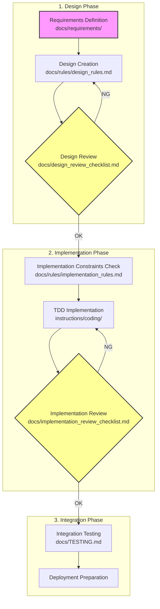

# Documentation Structure

This document outlines the structure of the `docs` directory, designed to provide clear and comprehensive information for AI-driven development.

## Development Flow Overview

### Key Points of the Flow Diagram

1. **Verify implementation constraints during design review**: Always check alignment with `implementation_rules.md` using the design review checklist (W-05)
2. **Mandatory review process**: Cannot proceed to the next phase without passing reviews
3. **Clear document cross-references**: Explicitly defined which documents to reference at each phase

## Core Documents

-   **`00_OVERVIEW.md`**: This file. It provides a high-level summary of the project, its purpose, and goals.
-   **`glossary.md`**: A glossary of terms to eliminate ambiguity and improve the precision of AI inference.
-   **`progress_board.md`**: Progress management board for centralized tracking of task status and assignees
-   **`troubleshooting.md`**: Knowledge base for technical issues and their solutions

## Detailed Specification Directories

-   **`domain/`**: Defines business rules, entities, and value objects. This enables coding based on clear business logic.
-   **`features/`**: Holds specifications for each distinct application feature, described from a user's perspective.
-   **`ui/`**: Provides details on screen layouts, user flows, event handling, and state management. This helps in deriving code for UI components.
-   **`examples/`**: Contains concrete examples of behavior or code snippets. This helps guide the AI to produce accurate and desired outputs.

## Design

see `docs/rules/design_rules.md`.

## Implementation

see `docs/rules/implementation_rules.md`.